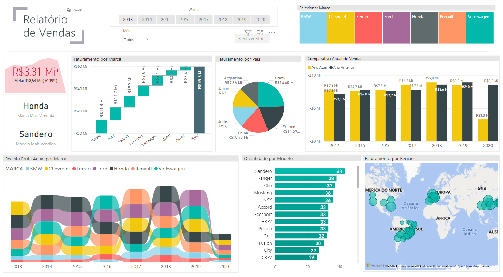
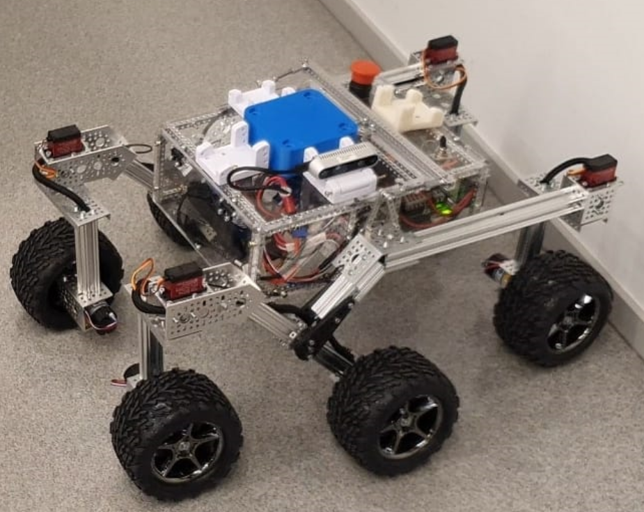
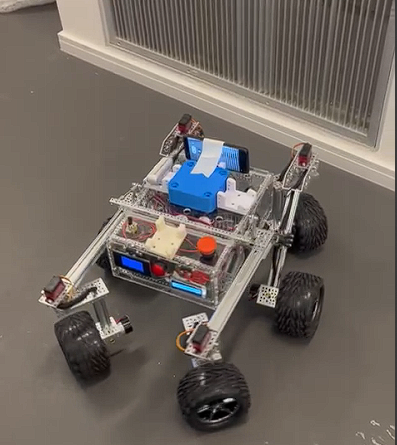

# Portfólio de Fernando Bichuette Assumpção

Bem-vindo ao meu portfólio! Sou um estudante de Engenharia Mecatrônica. Este portfólio reúne alguns dos projetos mais significativos que desenvolvi ao longo da minha trajetória acadêmica e profissional.

---

## Projetos

### [Dashboard de Vendas com Power BI](https://github.com/FernandoBichuette/Portfolio/tree/main/PowerBI)

**Descrição:** Este projeto envolveu a criação de um dashboard interativo de vendas utilizando Power BI. O objetivo foi transformar dados brutos em insights visuais claros e informativos, abrangendo várias métricas de vendas, como receita total, desempenho por região e análise de tendências ao longo do tempo.

**Tecnologias Utilizadas:** Power BI, Visualização de Dados, Business Intelligence

**Desafios e Soluções:**
- **Transformação de Dados:** Um dos principais desafios foi a limpeza e preparação dos dados para análise. Diversas transformações foram aplicadas para garantir a precisão e consistência dos dados, incluindo a remoção de duplicatas, tratamento de valores nulos e formatação de datas.
- **Criação de Visuais Impactantes:** Criar visuais que fossem informativos e visualmente atraentes foi essencial. Utilizando as funcionalidades avançadas do Power BI, foram desenvolvidos gráficos dinâmicos e interativos que facilitam a compreensão dos dados.
- **Automatização de Relatórios:** Implementação de funções DAX para automatizar o cálculo de métricas e criar relatórios que se atualizam automaticamente conforme os dados são modificados.

**Resultados:** O dashboard final fornece uma visão abrangente das vendas, permitindo aos usuários explorar os dados de forma interativa e obter insights valiosos sobre o desempenho de vendas em diferentes regiões e períodos. Este projeto demonstrou habilidades avançadas em Power BI, incluindo a manipulação de dados e a criação de visualizações eficazes.

### [Desenvolvimento de UGV Autônomo](https://github.com/pfeinsper/unmaned-ground-vehicle-2024.1)

**Descrição:** Projeto em parceria com a Embrapa para o desenvolvimento de um Veículo Terrestre Não Tripulado (UGV) autônomo, focado no monitoramento de pulgões em fruticultura e silvicultura.

**Tecnologias Utilizadas:** Python, Robótica e Automação, Sensores LIDAR, GPS, Fusão de Sensores.

**Desafios e Soluções:**
- **Integração de Sensores:** Superado com a implementação de um sistema de fusão de sensores utilizando filtros de Kalman.
- **Calibração de Navegação:** Ajustes de suspensão e algoritmos de controle adaptativo para estabilidade em terrenos acidentados.
- **Eficiência Energética:** Gerenciamento de energia otimizado com painéis solares e software de controle.
- **Comunicação de Dados:** Sistema de comunicação em rede mesh para transmissão estável de dados.

**Resultados:** Veículo autônomo funcional, testado em campo, operando de forma autônoma por longos períodos.

     

---

### [Robô Jogador de Xadrez](https://github.com/FernandoBichuette/Projeto-Xadrez.git)
**Período:** Ago 2023 – Dez 2023

**Descrição:** Desenvolvimento de um robô jogador de xadrez que integra visão computacional e a engine Stockfish para interpretar e responder às jogadas do adversário.

**Tecnologias Utilizadas:** Python, Visão Computacional, Processamento de Imagem, Stockfish.

**Desafios e Soluções:**
- **Detecção de Peças e Posições:** Implementação de técnicas avançadas de processamento de imagem para alta precisão.
- **Integração com Stockfish:** Sincronização entre a detecção de peças e a engine de xadrez para jogadas automáticas.

**Resultados:** Robô capaz de jogar xadrez de maneira autônoma com alto nível de precisão.

  

---

### [Automação de Linha de Montagem](https://github.com/FernandoBichuette/automation_project)

**Descrição:** Projeto focado na otimização de uma linha de montagem de dispositivos eletrônicos, utilizando a Pirâmide da Automação e a criação de um Digital Twin.

**Tecnologias Utilizadas:** CLPs, SCADA, MES, Digital Twin.

**Desafios e Soluções:**
- **Integração de Sistemas de Controle:** Desenvolvimento de soluções para a comunicação eficiente entre diferentes níveis de automação.
- **Criação do Digital Twin:** Simulação precisa da linha de montagem para otimização dos processos.

**Resultados:** Sistema de automação eficiente com monitoramento e controle de disponibilidade, desempenho e qualidade.

---

### [Máquina Pipetadora Automática](https://github.com/FernandoBichuette/Projeto-Mecatronico)

**Descrição:** Desenvolvimento de uma máquina pipetadora automática para otimizar processos laboratoriais.

**Tecnologias Utilizadas:** Mecânica de Precisão, Eletrônica Integrada, Desenvolvimento de Software.

**Desafios e Soluções:**
- **Dimensionamento Mecânico:** Realização de cálculos precisos e ajustes durante a fase de prototipagem.
- **Integração Eletrônica:** Sincronização entre os componentes mecânicos e eletrônicos para uma operação precisa.

**Resultados:** Protótipo funcional que melhora a eficiência e a precisão em processos de pipetagem.

---

### [Análise e Modelagem Preditiva do Mercado Imobiliário](https://github.com/arthurfc12/Projeto3CDados)

**Descrição:** Análise exploratória e modelagem preditiva do mercado imobiliário de São Paulo utilizando técnicas de Machine Learning.

**Tecnologias Utilizadas:** Python, Random Forest, Análise de Dados.

**Desafios e Soluções:**
- **Segmentação de Dados:** Análise cuidadosa dos dados para identificação de padrões e criação de um modelo preditivo eficiente.
- **Escolha do Modelo:** Implementação e validação de diferentes modelos de machine learning para otimização dos resultados.

**Resultados:** Modelo preditivo eficiente que oferece insights valiosos sobre as dinâmicas do mercado imobiliário em São Paulo.

---

## Contato
- [LinkedIn](https://www.linkedin.com/in/fernando-bichuette-assumpcao/)
- [GitHub](https://github.com/FernandoBichuette)
